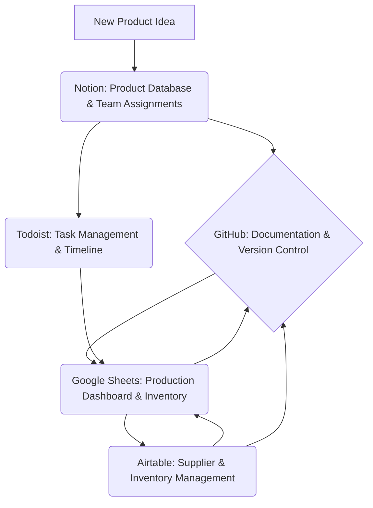
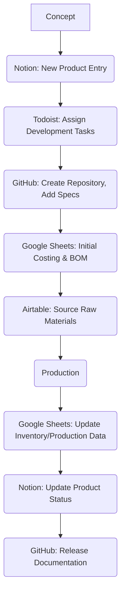

# MCP Tools Integration Guide

This guide outlines the comprehensive integration and workflow of all MCP tools for efficient operations, including documentation, version control, production management, task tracking, product databases, and supplier management.

## 1. Overview of Integrated Tools

*   **GitHub**: Documentation, version control, code collaboration.
*   **Google Sheets**: Production dashboard, inventory tracking, financial summaries.
*   **Todoist**: Task management, project timelines, personal and team assignments.
*   **Notion**: Product database, team assignments, internal knowledge base.
*   **Airtable**: Supplier management, detailed inventory, procurement tracking.

## 2. Workflow Diagrams

### High-Level Data Flow

### Product Development Workflow

## 3. Data Flow Between Systems

*   **Notion to GitHub**: Product specifications and requirements drafted in Notion are documented in Markdown files and committed to GitHub for version control.
*   **Notion to Todoist**: Product development tasks and team assignments from Notion are pushed to Todoist for individual and team tracking.
*   **Google Sheets to Airtable**: Inventory levels from Google Sheets can be used to trigger procurement processes in Airtable.
*   **Airtable to Google Sheets**: Supplier information and raw material inventory from Airtable are synchronized with Google Sheets for accurate production planning.
*   **GitHub to Google Sheets**: Release notes or production-related documentation changes in GitHub can be linked or summarized in Google Sheets for quick reference by production teams.
*   **Todoist to Notion**: Completed tasks in Todoist update project progress in Notion, providing a holistic view.

## 4. Synchronization Procedures

Manual and automated synchronization procedures ensure data consistency across all platforms.

*   **Daily Sync (Automated/Manual Review)**:
    *   **Google Sheets <> Airtable**: Inventory updates, new supplier data. (Automated via Pipedream/Zapier if applicable, with daily manual review).
    *   **Todoist <> Notion**: Task status and project progress. (Automated updates or weekly manual reconciliation).
*   **Weekly Sync (Manual)**:
    *   **GitHub <> Notion**: Ensure all key documentation updates from GitHub are reflected or linked within the relevant Notion pages.
*   **Event-Driven Sync (Manual/Automated)**:
    *   **New Product Launch**: Trigger updates across Notion (product database), GitHub (documentation), Google Sheets (BOM, costing), and Todoist (launch tasks).

## 5. Daily Operational Checklist

This checklist ensures all tools are utilized effectively for daily operations.

### Morning (Start of Day)

1.  **Todoist**: Review "My Day" and "Upcoming" tasks. Prioritize. Update any completed tasks.
2.  **Google Sheets**: Check production dashboard for yesterday's output and current inventory levels. Note any discrepancies.
3.  **Notion**: Review team assignments and project updates. Check relevant product pages for new comments or critical information.
4.  **Airtable**: Check for any urgent supplier communications or incoming raw material deliveries.

### Throughout the Day

1.  **Todoist**: Update tasks as they are completed or new ones arise.
2.  **GitHub**: Commit any documentation changes, code updates, or new specifications. Ensure pull requests are reviewed promptly.
3.  **Google Sheets**: Enter production data, track new inventory, update sales figures as needed.
4.  **Notion**: Document new decisions, update product information, assign new tasks to team members.
5.  **Airtable**: Process new purchase orders, update supplier communications, track incoming/outgoing inventory.

### End of Day

1.  **Todoist**: Plan for tomorrow, move unfinished tasks to the next day.
2.  **Google Sheets**: Ensure all production and inventory figures are up-to-date.
3.  **Notion**: Quick review of project dashboards and team progress.
4.  **GitHub**: Verify all important documentation changes have been committed.

This integrated approach ensures seamless operations, improved data accuracy, and enhanced collaboration across all teams.